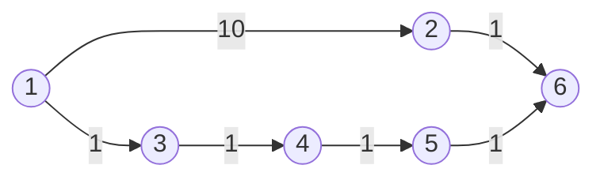

# Weighted BFS Versus Shortest-Path Dataset

This six-vertex directed graph demonstrates why BFS and weighted shortest path
are different algorithms.

## Input format

```text
vertexId neighborId:weight neighborId:weight ...
```

The dataset defines these edges:

```text
1 -> 2  weight 10
1 -> 3  weight 1
2 -> 6  weight 1
3 -> 4  weight 1
4 -> 5  weight 1
5 -> 6  weight 1
```

Vertex 6 has no outgoing edges, so its line contains only its ID.

## Diagram

The generated [SVG diagram](../../diagrams/weighted-bfs-comparison.svg) is
available for reports and presentations.



## Expected BFS result from vertex 1

BFS minimizes the number of edges and ignores their weights:

```text
1    0.0
2    1.0
3    1.0
4    2.0
5    3.0
6    2.0
```

BFS reaches vertex 6 through `1 -> 2 -> 6`, which uses two hops.

## Expected weighted shortest-path result from vertex 1

Weighted shortest path minimizes the sum of edge weights:

```text
1    0.0
2    10.0
3    1.0
4    2.0
5    3.0
6    4.0
```

The two-hop route `1 -> 2 -> 6` costs `10 + 1 = 11`. The four-hop route
`1 -> 3 -> 4 -> 5 -> 6` costs only `1 + 1 + 1 + 1 = 4`. Therefore BFS gives
vertex 6 a distance of 2 hops, while weighted shortest path gives it a total
cost of 4.

## Verified execution

Both jobs were run successfully with Giraph on 16 September 2026. Their actual
outputs matched the expected values exactly. See the
[`verified results`](../../results/weighted-bfs-comparison/).
