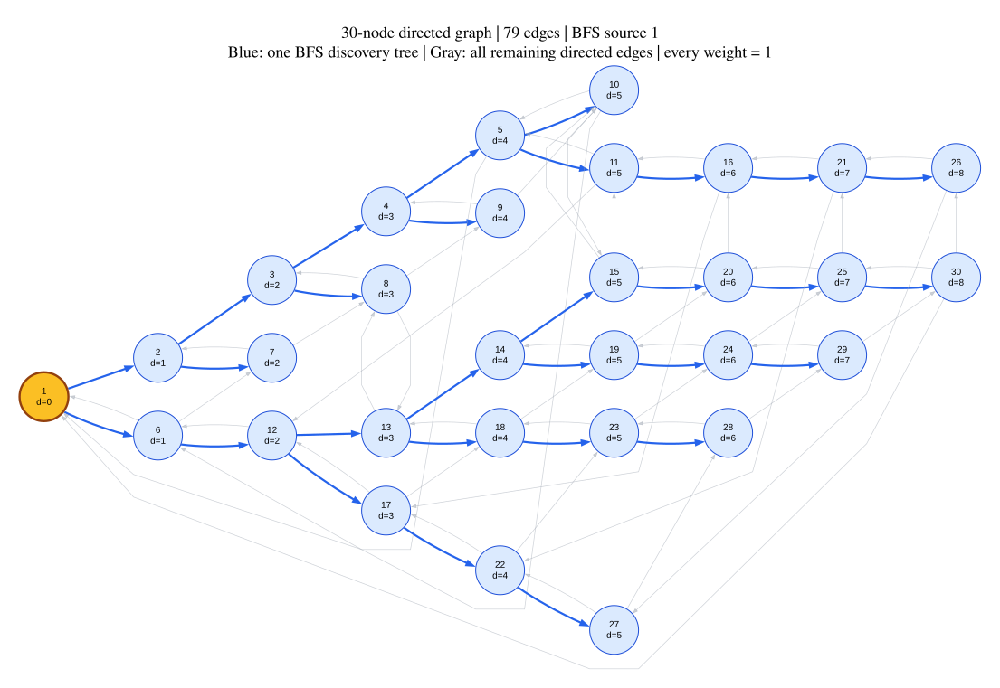

# Graph Diagrams

This folder keeps data-accurate graph diagrams and their editable sources.
These are generated from the committed dataset rather than drawn by an image
model, so vertices and edges can be verified.

## Thirty-node graph



The complete diagram contains all 30 vertices and all 79 directed edges from
the three files in [`../datasets/thirty-node-text/`](../datasets/thirty-node-text/).

- The orange node is BFS source vertex 1.
- Each node label includes its ID and verified BFS distance from vertex 1.
- Blue arrows form one valid BFS discovery tree.
- Gray arrows are the remaining directed edges in the original graph.
- All edge weights are 1 and are omitted from the drawing to keep it readable.

For reports and presentations, download either the scalable
[`SVG`](thirty-node-full-graph.svg) or the high-resolution
[`PNG`](thirty-node-full-graph.png).

The editable Graphviz source is
[`thirty-node-full-graph.dot`](thirty-node-full-graph.dot). Regenerate it from
the dataset with:

```bash
python scripts/generate_graphviz_from_text.py \
  datasets/thirty-node-text \
  diagrams/thirty-node-full-graph.dot \
  --source 1
```

Render the DOT file with Graphviz:

```bash
dot -Tsvg diagrams/thirty-node-full-graph.dot \
  -o diagrams/thirty-node-full-graph.svg
```

The simplified BFS-only diagram and full explanation are in
[`../docs/BFS-THIRTY-NODE-WALKTHROUGH.md`](../docs/BFS-THIRTY-NODE-WALKTHROUGH.md).
