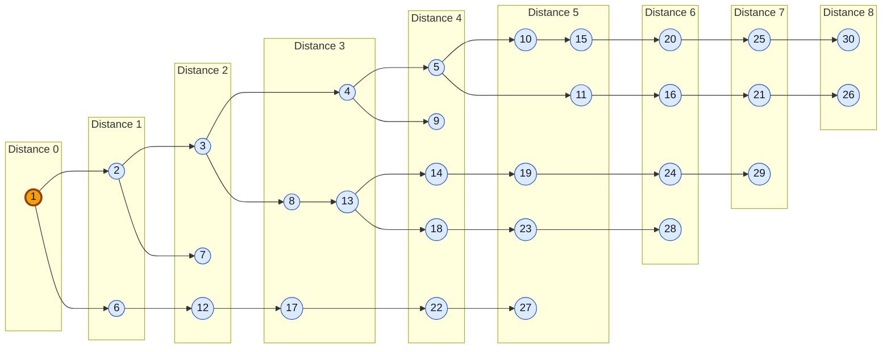

# Understanding the BFS Result on the Thirty-Node Graph

## What we calculated

We ran breadth-first search (BFS) on the 30-vertex directed graph using vertex
`1` as the source. BFS answers this question:

> What is the minimum number of directed edges required to reach each vertex
> from vertex 1?

The calculation produced one row for every vertex:

```text
vertex_id    minimum_hops_from_source_1
```

For example:

```text
1    0.0
6    1.0
17   3.0
30   8.0
```

- Vertex `1` has distance `0` because it is the source.
- Vertex `6` has distance `1` because the dataset contains the edge `1 -> 6`.
- Vertex `17` has distance `3`, for example through `1 -> 6 -> 12 -> 17`.
- Vertex `30` has distance `8`; no route from vertex 1 uses fewer than eight
  directed edges.

The output uses values such as `3.0` because the Giraph computation stores a
distance in `DoubleWritable`. For BFS these values are whole hop counts, so
`3.0` means three edges, not three seconds or an edge weight of three.

## How one input line becomes graph edges

The first dataset line is:

```text
1 2:1 6:1
```

It defines two outgoing edges:

```text
1 -> 2
1 -> 6
```

The value after each colon is the edge weight. BFS ignores the weight and
counts each traversed edge as one hop. The graph is directed, so an edge from
`1` to `2` does not automatically create an edge from `2` to `1`.

## Manual calculation in BFS levels

BFS starts at the source and expands one layer at a time. The verified levels
for this dataset are:

| Distance from 1 | Vertices discovered at this level |
|---:|---|
| 0 | 1 |
| 1 | 2, 6 |
| 2 | 3, 7, 12 |
| 3 | 4, 8, 13, 17 |
| 4 | 5, 9, 14, 18, 22 |
| 5 | 10, 11, 15, 19, 23, 27 |
| 6 | 16, 20, 24, 28 |
| 7 | 21, 25, 29 |
| 8 | 26, 30 |

These rows contain all 30 vertices exactly once. Therefore every vertex is
reachable from vertex 1, and the greatest minimum distance is eight hops.

## BFS discovery diagram

The following diagram shows one shortest-hop discovery tree rooted at vertex
1. It is not showing all 79 edges in the original graph because those extra
cross-links would hide the BFS levels. Every arrow displayed here is an actual
directed edge in the dataset. A vertex may have another equally short parent,
but the diagram selects one parent so that the calculation stays readable.



Read the diagram from left to right. Moving across one arrow increases the BFS
distance by one. For example, following `1 -> 6 -> 12 -> 17 -> 22` reaches
vertex 22 in four hops.

### First two expansions by hand

At distance 0, only the source is known:

```text
{1}
```

Vertex 1 points to vertices 2 and 6, so the next level is:

```text
distance 1 = {2, 6}
```

The relevant input records are:

```text
2 3:1 7:1
6 1:1 7:1 12:1
```

Following their outgoing edges discovers vertices 3, 7 and 12. Vertex 1 is
not updated because its existing distance 0 is already smaller. Vertex 7 can
be reached from both 2 and 6, but both routes have length 2, so it still has
only one final minimum-distance value:

```text
distance 2 = {3, 7, 12}
```

The same process continues until expanding a level produces no shorter value
for any vertex.

## Example shortest-hop routes

One valid minimum-hop route to vertex 17 is:

```text
1 -> 6 -> 12 -> 17
```

It contains three edges, so the output contains `17  3.0`.

One valid minimum-hop route to vertex 30 is:

```text
1 -> 6 -> 12 -> 17 -> 22 -> 27 -> 28 -> 29 -> 30
```

It contains eight edges, so the output contains `30  8.0`.

BFS may have more than one equally short route to a vertex. It reports the
minimum distance, not the complete route or a parent vertex. Recording the
actual route would require extending the computation to store predecessor
information.

## How Giraph performs the calculation

Giraph uses synchronized rounds called **supersteps**.

1. Every vertex initially represents an unknown distance. The selected source
   vertex 1 changes its distance to 0.
2. The source sends the value 1 to each outgoing neighbour.
3. A receiving vertex compares all incoming proposals and its current value.
   It keeps only the smallest distance.
4. A vertex whose distance improved sends `distance + 1` to its outgoing
   neighbours for the next superstep.
5. A vertex whose value did not improve sends nothing and votes to halt.
6. Giraph finishes when every vertex is inactive and no messages remain.

The message exchange is the important distributed-computing part. Each worker
can hold different graph partitions, but messages allow the BFS frontier to
move across partition boundaries. The three input files are one logical input
dataset; file boundaries do not change the graph or the BFS answer.

## Simplified logic used by the Java computation

The main idea of `LearningBfsComputation` is:

```text
if this vertex is the source:
    proposed distance = 0
otherwise:
    proposed distance = the smallest received message

if proposed distance is smaller than the stored distance:
    save the proposed distance
    send proposed distance + 1 to every outgoing neighbour

vote to halt until another message arrives
```

The source is selected through the Giraph custom configuration value:

```text
LearningBfsComputation.sourceId=1
```

Changing this value allows BFS to start from another vertex without changing
or recompiling the Java class.

## BFS compared with weighted shortest path

BFS minimizes the number of edges:

```text
BFS distance = number of hops
```

Weighted shortest path minimizes the sum of edge weights:

```text
weighted distance = sum of weights on the route
```

Every edge in the present dataset has weight 1. The weighted shortest-path job
was run from source 1 and produced exactly the same 30 values as BFS. A direct
comparison returned exit code `0`, confirming that there was no difference.
A future test should use different positive weights to demonstrate a case
where the fewest-hop route and the lowest-weight route are different.

## How we verified the result

- Giraph produced 30 output rows for 30 defined vertices.
- Every vertex appeared once.
- The source had distance 0.
- Direct neighbours 2 and 6 had distance 1.
- The output matched all manually calculated BFS levels.
- No infinity value appeared, so all vertices were reachable from source 1.
- The weighted shortest-path output matched BFS for every vertex, as expected
  for edges that all have weight 1.

The complete result is stored in
[`../results/thirty-node-text/bfs-from-1.txt`](../results/thirty-node-text/bfs-from-1.txt).
The matching weighted result is stored in
[`../results/thirty-node-text/shortest-path-from-1.txt`](../results/thirty-node-text/shortest-path-from-1.txt).
